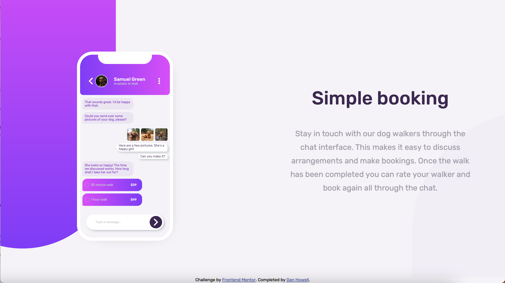

# Frontend Mentor - Chat app CSS illustration solution

This is a solution to the [Chat app CSS illustration challenge on Frontend Mentor](https://www.frontendmentor.io/challenges/chat-app-css-illustration-O5auMkFqY). Frontend Mentor challenges help you improve your coding skills by building realistic projects.

## Table of contents

- [Overview](#overview)
  - [The challenge](#the-challenge)
  - [Screenshot](#screenshot)
  - [Links](#links)
- [My process](#my-process)
  - [Built with](#built-with)
  - [Continued development](#continued-development)
- [Author](#author)

**Note: Delete this note and update the table of contents based on what sections you keep.**

## Overview

### The challenge

Users should be able to:

- View the optimal layout for the component depending on their device's screen size
- **Bonus**: See the chat interface animate on the initial load (not implemented yet)

### Screenshot

### Links

- Solution URL: [Solution on Frontend Mentor](https://www.frontendmentor.io/solutions/mostly-vanilla-htmlcss-and-mobilefirst-design-xt5pp7IEf7)
- Live Site URL: [Live Site](https://cdanhowell.github.io/frontend-mentor-chatapp-illustration-challenge/)

## My process

Essentially, my goal with this project was to strip out as much of the "cool" tools that I'm using to using and get down to the core basics of building an application. For development, I did use vitejs as a dev server and build tool and I did leverage a couple of Postcss plugins, but in terms of the actual html and css, I tried to keep things as vanilla as possible... though I did do some code splitting and importing to make my lift a bit easier!

### Built with

- Semantic HTML5 markup
- CSS custom properties
- Flexbox
- CSS Grid
- Mobile-first workflow
- Vite
- PostCss

### Continued development

I'd love to tackle the animation concept that is included in the challenge. It would be cool to animate the phone illustration in as simulate the conversation happening in real time on page load

## Author

- Website - [Dan Howell](https://www.syntesesolutions.com)
- Frontend Mentor - [cdanhowell](https://www.frontendmentor.io/profile/cdanhowell)
